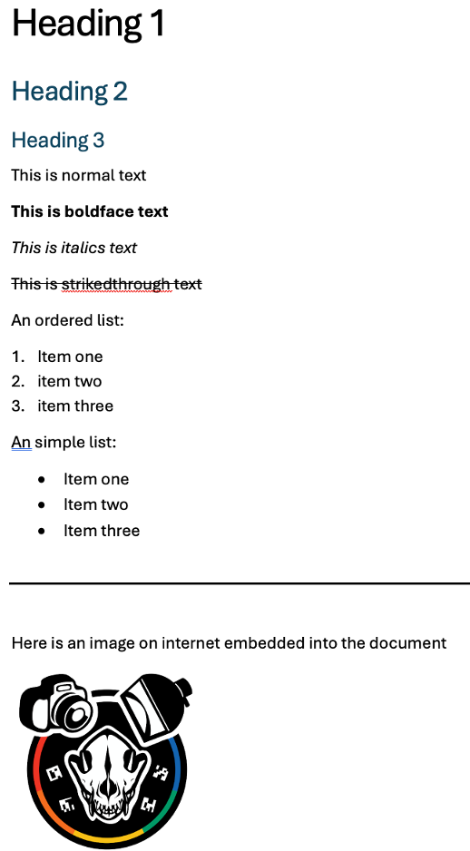

# Introduction to remote collaborations
This repository is meant to demonstrate how remote collaborations are done using git and github infrastructure under a **fork and contribute** model. It has a simple exercise that provides an introduction to markdown styling conventions to write simple documents. The exercise can be completed entirely through the github web infrastructure without using git commands. The purpose is to demonstrate basic concepts of communication through issues page, forking, creating new commits/branches, and then sending a pull request for the repository owner to review the changes and if they like, merge them with their own repository. 

Here are some basic introduction to the how collaborations work in open-source projects through github (and similar services). 
1. A very broad view of fork and contribute model (look only the section called **Fork and Pull**): http://www.goring.org/resources/project-management.html
2. A step-by-step instruction on how to fork, commit and pull a project: https://heardlibrary.github.io/digital-scholarship/manage/control/github/fork/

Here is also a simple guide to Markdown syntax, which you will need to complete the exercise: https://www.markdownguide.org/basic-syntax/
Keep in mind in Markdown you can use any valid HTML syntax (such as embedding images in documents). 

Finally, a URL to an image, which you will need to complete the exercise described below: https://github.com/SlicerMorph/SlicerPhotogrammetry/blob/master/Photogrammetry/Resources/Icons/Photogrammetry.png

## Exercise description
1. Go to the issues page of this repository and create a new issue indicating you will like to make a contribution.
2. Fork this repository under your own account
3. Create new markdown document using the convention **YourFullName.md** in your own fork called. This document should render the provided exercise image below in markdown format as closely as possible (including the embedded image).
4. Commit your changes to your own fork and then submit a pull request.

## Here is the exercise image

